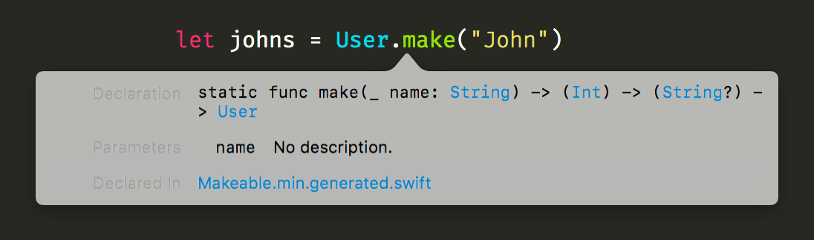
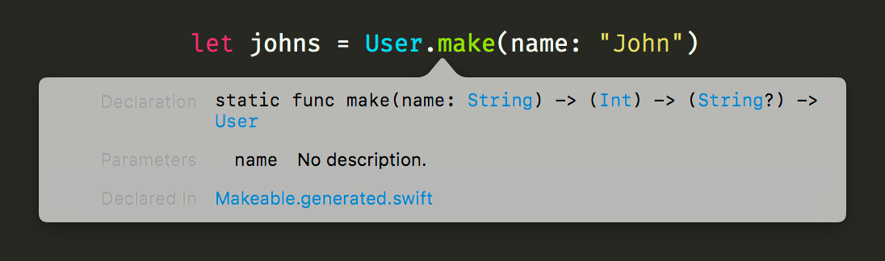

# Makeable Template for Sourcery

A template for [Sourcery](https://github.com/krzysztofzablocki/Sourcery) that will generate a curried initializer.

## Example

Please visit [Sourcery](https://github.com/krzysztofzablocki/Sourcery) to see how to use it.

Once you have sourcery running you can choose between `Makeable.stencil` and `Makeable.min.stencil` depending on your preference.

Then you have to copy the `MakeableProtocol.swift` and the template to your project. Then start by implementing `Makeable` to your `struct`s which should have the function generated. (If you want to skip this step check the [tips](#tips).)

If you have ideas for improvements check my [ToDos](#todo) and [contact me](#author).

| Makeable.min.stencil | Makeable.stencil |
| :--- | :--- |
|  |  |

### Input:
``` Swift
struct User: Makeable, Equatable {
    let name: String
    let id: Int
    let email: String?
}

struct File: Makeable, Equatable {
    let name: String
    let fileEnding: String
    let locked: Bool
    var owner: User
}
```

### Output Minified:
``` Swift
extension File {
    static func make(_ name: String) -> (_ fileEnding: String) -> (_ locked: Bool) -> (_ owner: User) -> File {
        return { fileEnding in { locked in { owner in File(name: name, fileEnding: fileEnding, locked: locked, owner: owner) } } }
    }
}

extension User {
    static func make(_ name: String) -> (_ id: Int) -> (_ email: String?) -> User {
        return { id in { email in User(name: name, id: id, email: email) } }
    }
}
```

### Output:
``` Swift
extension File {
    static func make(name: String) -> (_ fileEnding: String) -> (_ locked: Bool) -> (_ owner: User) -> File {
        return { (fileEnding: String) in { (locked: Bool) in { (owner: User) in
            File(name: name, fileEnding: fileEnding, locked: locked, owner: owner)
        } } }
    }
}

extension User {
    static func make(name: String) -> (_ id: Int) -> (_ email: String?) -> User {
        return { (id: Int) in { (email: String?) in
            User(name: name, id: id, email: email)
        } }
    }
}
```

## Tips
- You can remove `.implementing.Makeable` from the template to generate a make function for every struct.
- You can change `types.structs.implementing.Makeable` to `types.implementing.Makeable` to remove the restriction of structs.
- The structs variables order defines the `make` functions order.
- The default templates work fine with [SwiftFormat](https://github.com/nicklockwood/SwiftFormat).

## ToDo
- Use macros and template inheritance to reuse code more.
- What should be done with variables which have a default value? Right now the default value is ignored.

## Author

Jan Dammshäuser, [mail@jandamm.de](mailto:mail@jandamm.de), [@jandammm](https://twitter.com/jandammm)

## License

Makeable Template for Sourcery is available under the MIT license. See the LICENSE file for more info.
